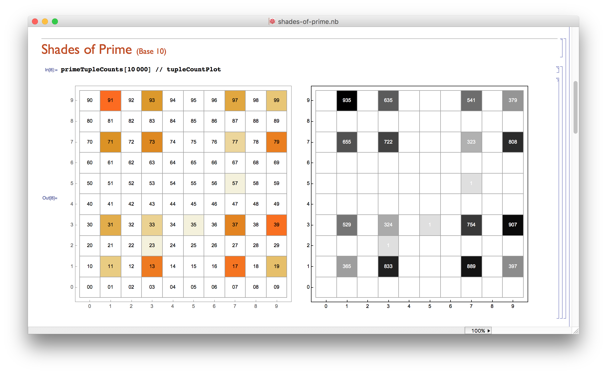
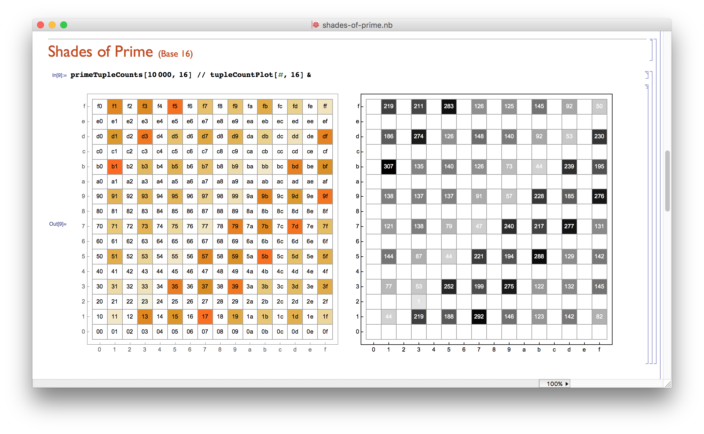
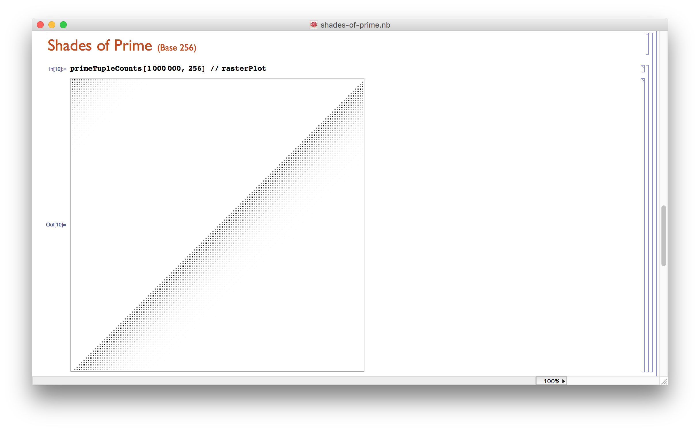
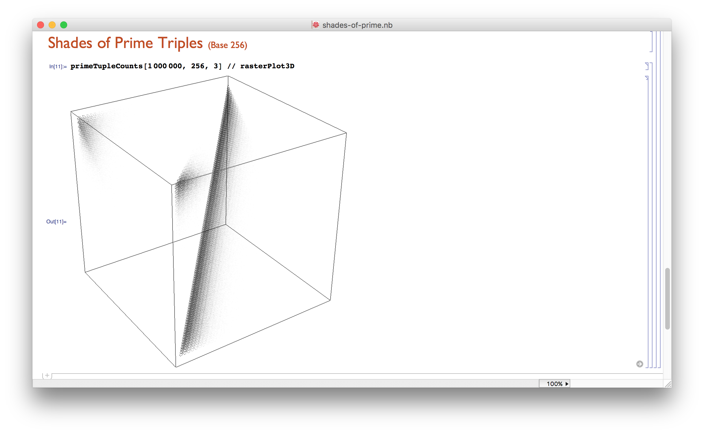

## Shades of Prime

[Exploring the Patterns in the last digits of Prime Numbers](http://www.nature.com/news/peculiar-pattern-found-in-random-prime-numbers-1.19550)

Prime numbers are less random than mathematicians used to think they were.  
This is immediately evident when looking at the frequency of the last digits of consecutive primes.

### Code

I wrote some code in Mathematica. You can download it [here](shades-of-prime.m).

### Prime Pairs

Note how the combinations 11, 33, 77 and 99 occur less frequently than other digit combos.  

### Prime Pairs (Base 16)

Using base 10 is somewhat arbitrary.  
Let's look at higher bases which are powers of two, for example base 16.
Note, that there is some kind of gradient going on here!  
Also there seem to be ripples inside the gradient

### Prime Pairs (Base 256)

Let's pick even higher bases to see if the gradient persists.  
Indeed: much gradient, still ripples!

### Prime Triples (Base 256)

And here's a visualization of triples of primes...

### Multi-Prime Sequences

So how do we get to visualize longer sequences of primes?  
As a matter of fact, I just googled to see if it has been done yet, and **lo and behold**!

**>>> Check out [this paper](http://www.sciencedirect.com/science/article/pii/S0960077901001357) by [Chung-Ming Ko](http://www.astro.ncu.edu.tw/old_www/index_e.shtml?p=iancu/people/faculty/ko_cm.html)! <<<**

He visualized the last digit for longer sequences of prime numbers using a fractal projection scheme back in 2002.

Since the subdivision scheme is restricted to a [Quadtree](https://de.wikipedia.org/wiki/Quadtree)-style subdivision of the plane, he constrained himself to explore the bases 5, 8, 10 and 12, because for each of those bases there are essentially just four digits to consider
(Such as 1,3,7 and 9 for base 10)

### Shades of Multi-Prime Sequences

So the real challenge is still an open question:

* How to visualize shades of primes for longer sequences and higher bases?
* Will this reveal any structure beyond what the statistical combination of the pair-wise probabilities would suggest?
